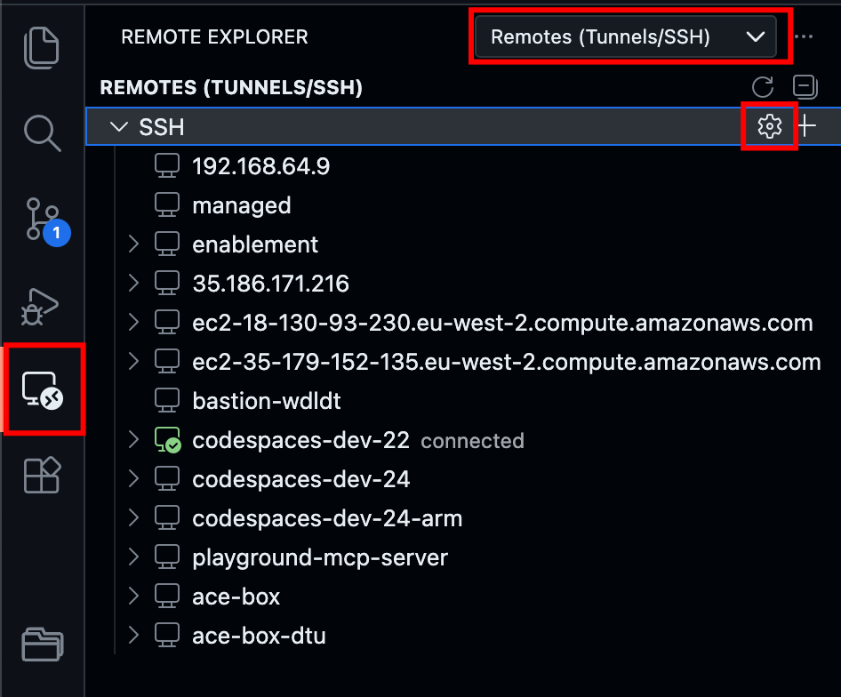
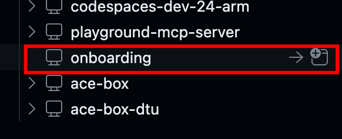
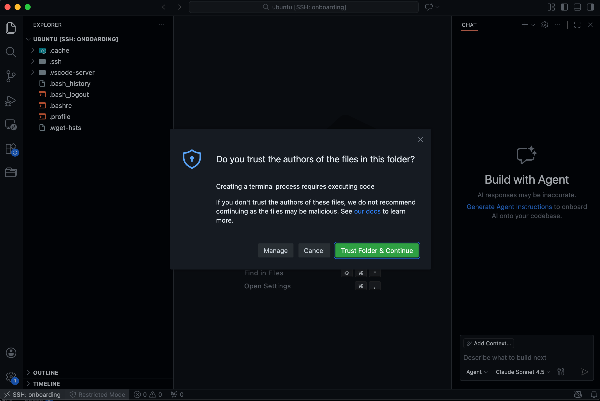

--8<-- "snippets/getting-started.js"
--8<-- "snippets/grail-requirements.md"

## 1. Prerequisistes


- Create EC2 instance
- Download VS Code

In this sections we need to download the stuff and create the ec2 instance

### 1.1 Create an EC2 Instance

For the remote environment we'll use an EC2 Instance in the AWS cloud.

Navigate to your AWS

- Give it a name like `Sergio Hinojosa's Environment`
- Select Ubuntu as OS
- Amazon Machine Image (AMI)
    - Ubuntu Server 24.04 LTS (HVM), SSD Volume - Architecture 64-bit (x86)
- Instance Type
    - t3.xlarge (4vCPU 16 GiB Memory)
- Key pair
    - If you don't have one, create it
    - Enter key pair name
    - Type: RSA
    - Format: pem
    - Create it and download it to your computer (A good place could be something like `/Users/firstname.lastname/.aws/keys/onboarding.pem` )
- Disk
    - Allocate 40 Gig of Disk space, this should be more than enough for your onboarding journey
- Network policies Incomming 22, 8000, 30100, 30200, 30300
- Launch instance

<!-- 
t2.xlarge in Virginia Linux base 0.1856 USD
t3.xlarge in Virginia Linux base 0.1664 USD
t2.xlarge in London Linux base 0.2112 USD
t3.xlarge in London Linux base 0.1888 USD

--- x.large comparison ---
		virginia	london
	t2/h	0,19 €	0,21 €
	t3/h	0,17 €	0,19 €
24	t2/day	4,45 €	5,07 €
24	t3/day	3,99 €	4,53 €
30	t2/month	133,6320	152,06 €
30	t3/month	119,8080	135,94 €
		11,54%	11,86%

t2 and t3 increase of 12% increase regardless of zone
---- ----- ----- -----
Performance and CPU Credits:

T2 Instances: Use a fixed CPU credit system. They accumulate CPU credits when idle and spend them when they are active. They have limited baseline CPU performance.
T3 Instances: Are more efficient with a burstable CPU model and are not only capable of sustaining burst performance but can also use unlimited mode, which allows them to exceed their CPU credits whe

In summary, T3 instances provide better overall performance, efficiency, and cost-effectiveness compared to T2 instances. For new applications and workloads, T3 is generally recommended over T2.

-->


### 1.2 Connect to your instance via SSH
A public IP has been assigned to your server, let's connect to it via SSH. Let's say I received the public ip `18.171.190.13` and I saved my pem in the location `/Users/sergio.hinojosa/.aws/keys/emea-eu-west-2.pem` then the SSH command for the default user (ubuntu) will look like this:

```bash
ssh -i /Users/sergio.hinojosa/.aws/keys/emea-eu-west-2.pem ubuntu@18.171.190.13
```
since we don't want to type this every time, let's configure VS Code.


### 1.2 Download Visual Studio Code

- Go to  [https://code.visualstudio.com](https://code.visualstudio.com), download and install Visual Studio on your machine. 

!!! tip "Tipp"
    Working on a local Visual Studio Code, maximizes your productivity, you'll be able to connect to dev.containers remotely, locally, install plugins, and much more.


## 2. Configure SSH Connection

{ align=right ; width="320"; }

- Open VS Code
- On the left panel you'll see a `Remote Explorer` icon, click on it.
- Select `Remotes (Tunnels/SSH)`
- Click on the Wheel ⚙️ icon
- A prompt will appear, which configuration file you want to update, I select `/Users/sergio.hinojosa/.ssh/config`
- The file will open in VS Code, add the following entry for the SSH client

    ```config title="Users/firstname.lastname/.ssh/config"
    # Onboarding Remote Environment
    Host onboarding
    HostName 18.171.190.131
    User ubuntu
    IdentityFile /Users/sergio.hinojosa/.aws/keys/emea-eu-west-2.pem
    ```
    For ease of use the server name will be called `onboarding`. This name will resolve only locally. We assign an IP address to that name, a username and the identity file.

- save the file and test the connection.

## 2.1 Test SSH Connection

In a terminal type

```bash
ssh onboarding
```
if you configured correctly you'll be able to connect to the server succesfully.  You can also do `ssh onboarding -v` to see what the SSH Client is doing and where is getting the configuration for that server.

## 2.2 Connect using VS Code

{ align=right ; width="300"; }

On the panel now you'll see a server called `onboarding`, if you click on the arrow it will use the instance of VS Code to connect to it, if you click in the + sign, it will create a new VS Code instance and connect to it. 

It will look something like this:

 

Trust the author and the contents of the server, after all it's your own playground. Now you have within VS Code full access to your remote environment! This will boost your onboarding learning experience.

## 3. Configure the enablement environment

We are connecting to a new LTS Ubuntu server, let's install the tools to run the enablement environment.

### 3.1 Clone this repository
Open a terminal and clone the reposisory.
```bash
git clone https://github.com/dynatrace-wwse/remote-environment
```

### 3.2 Prepare Host
```bash
cd remote-environment
source .devcontainer/util/source_framework.sh && checkHost
```
Type yes to install all requirements for the framework.


### 3.3 Get Dynakube and Tokens 

Go to the Kubernetes App in your Dynatrace environment


Select:

- Other distributions
- Enable Log management and analytics
- Enable Extensions
- Enable Telemetry endpoints for data ingestremotete
- Give the cluster a name  `remote-environment`
- For Networkzone and Hostgroup give also a name `remote-environment`


- Generate a Dynatrace Operator token and a Data Ingest token 
    - ⚠️ Copy and save both Tokens in your Clipboard!


!!! important "Save Tokens to your Clipboard 📋"
	Save the Operator Token and Data Ingest Token to your clipboard

- 💾 Download the `Dynakube.yaml`file


### 3.4 Set the environment variables

**Set up secrets and environment variables**

Go back to the server and create an .env file in `.devcontainer/runlocal/.env`

!!! info "Sample `.env` file"
	You can copy and paste the following sample into `.devcontainer/runlocal/.env`. Your environment file should look similar to this:

	```properties title=".devcontainer/runlocal/.env" linenums="1"
	# Environment variables as defined as secrets in the devcontainer.json file
	# Dynatrace Tenant
	DT_ENVIRONMENT=https://abc123.sprint.apps.dynatracelabs.com
		
    # Dynatrace Operator Token
	DT_OPERATOR_TOKEN=dt0c01.XXXXXX

	# Dynatrace Ingest Token
	DT_INGEST_TOKEN=dt0c01.YYYYYY

	```


## 4. Start the enablement environment

### 4.1 Start the dev container
We are ready to start the environment, go to the .devcontainer folder and start the container.

```bash
cd .devcontainer
make start
```

`make start` will either start the environment or attach a new shell to the container in case it is running. The environment is only configured to create and start a Kind Cluster.

### 4.2 Monitor the Kubernetes cluster

We will monitor the Kubernetes cluster running in the environment, for this type the following commands to get a quick overview of whats running inside Kubernetes

```bash
# List the nodes
kubectl get nodes -o wide

# List the ressources
kubectl get all -A

```

You'll notice this is a single node cluster (kind) and it has the minimum kubernetes services such as etcd, api-server, scheduler and proxy running on it. 


#### 4.2.1 Install the Dynatrace Operator

We install the Dynatrace Operator using HELM as in the instructions or wizard.

```bash
helm install dynatrace-operator oci://public.ecr.aws/dynatrace/dynatrace-operator \
--create-namespace \
--namespace dynatrace \
--atomic
```

#### 4.2.2 Deploy Dynakube with Cloud Native FullStack


##### Transfer the Dynakube file to the server
{ align=right ; width="300";}

Copy and paste the dynakube file to the server. Using VS Code is a piece of cake. I recommend to create a `/tmp` folder since this is omitted in `.gitignore` so no files will be staged. Right mouse click and create new folder, then copy the downloaded dynakube.yaml file and paste it inside the folder. VS Code will do the SSH transfer for you.


##### Deploy the Dynakube using kubectl

```bash
kubectl apply -f tmp/dynakube.yaml
```


### 4.3 Deploy the Astroshop

In the terminal inside your dev.container, type:

```bash
deployApp astroshop
```
This will deploy the Astroshop for you.

Once it's deployed, navigate to the public ip of your server and enter the http://PUBLIC-IP:30100. The framework exposes the apps using the ports 30100, 30200, 30300 using a NodePort configuration. 


!!! tip "What we have done"
    That's it! you have set up succesfully a remote enablement environment with the Astroshop being monitored with Dynatrace CloudNative FullStack. You've configured VS Code to shell securely into the server so this setup can boost your learning experience.

Dive into the next section if you want to learn some tipps and tricks about your enablement environment.

WIP: Tipps and Tricks


- [ ] Start/Stop/Create new Kind cluster
- [ ] See if the container is running, List docker containers
- [ ] Remove the containers, start new fresh environment
- [ ] Navigate using k9s
- [ ] List Apps, deploy new Apps
- [ ] Create new Terminal


<div class="grid cards" markdown>
- [Let's launch Codespaces:octicons-arrow-right-24:](3-content.md)
</div>
