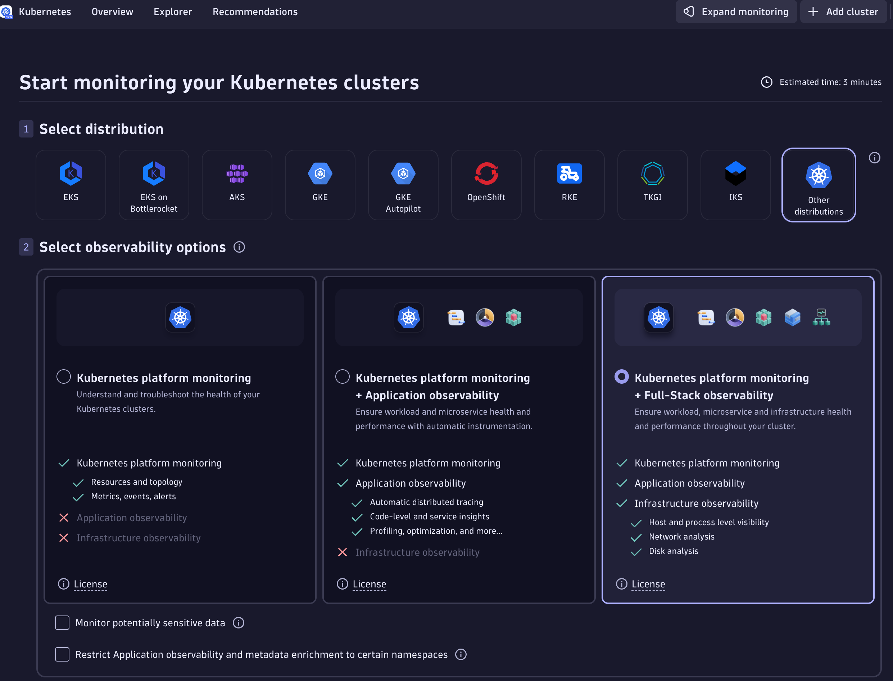
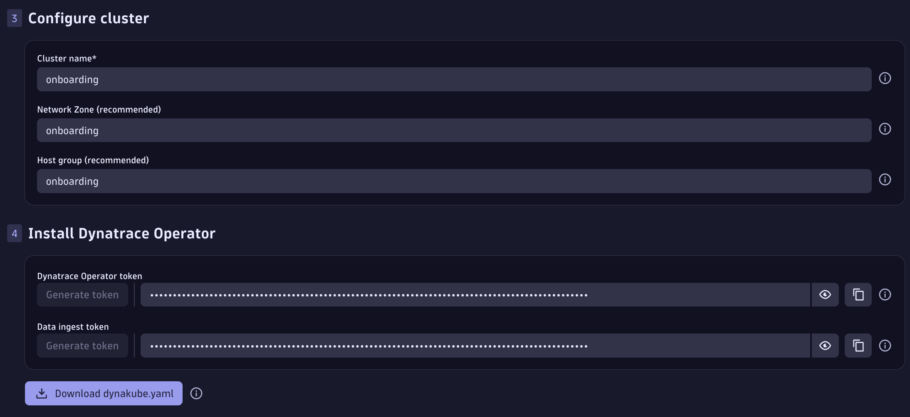

--8<-- "snippets/getting-started.js"
--8<-- "snippets/grail-requirements.md"

## 1. Prerequisistes


- Create EC2 instance
- Download VS Code

In this sections we need to download the stuff and create the ec2 instance

### 1.1 Create an EC2 Instance

- Ubuntu 24 LTS
- Memory
- CPU
- Disk
- Network policies Incomming 22, 8000, 30100, 30200, 30300
- Download SSH key


### 1.2 Download Visual Studio Code

- Go to  [https://code.visualstudio.com](https://code.visualstudio.com), download and install Visual Studio on your machine. 

!!! tip "Tipp"
    Working on a local Visual Studio Code, maximizes your productivity, you'll be able to connect to dev.containers remotely, locally, install plugins, and much more.


## 2.  Configure SSH Connection with VS Code (step is WIP)
TODO: Add instructions how to setup VS Code with SSH key for ease of use. 
- Get public IP of instance
- Add it to VS Code


## 3. Configure the enablement environment

### 3.1 Prepare Host
```bash
source .devcontainer/util/source_framework.sh && checkHost
```

Type yes to install all requirements for the framework.


### 3.2 Get Dynakube and Tokens 

Go to the Kubernetes App in your Dynatrace environment


Select:

- Other distributions
- Enable Log management and analytics
- Enable Extensions
- Enable Telemetry endpoints for data ingestremotete
- Give the cluster a name  `remote-environment`
- For Networkzone and Hostgroup give also a name `remote-environment`



- Generate a Dynatrace Operator token and a Data Ingest token 
    - ⚠️ Copy and save both Tokens in your Clipboard!



!!! important "Save Tokens to your Clipboard 📋"
	Save the Operator Token and Data Ingest Token to your clipboard

- 💾 Download the `Dynakube.yaml`file


### 3.3 Set the environment variables

**Set up secrets and environment variables**

Go back to the server and create an .env file in `.devcontainer/runlocal/.env`

!!! info "Sample `.env` file"
	You can copy and paste the following sample into `.devcontainer/runlocal/.env`. Your environment file should look similar to this:

	```properties title=".devcontainer/runlocal/.env" linenums="1"
	# Environment variables as defined as secrets in the devcontainer.json file
	# Dynatrace Tenant
	DT_ENVIRONMENT=https://abc123.sprint.apps.dynatracelabs.com
		
    # Dynatrace Operator Token
	DT_OPERATOR_TOKEN=dt0c01.XXXXXX

	# Dynatrace Ingest Token
	DT_INGEST_TOKEN=dt0c01.YYYYYY

	```


## 4. Start the enablement environment

### 4.1 Start the dev container
We are ready to start the environment, go to the .devcontainer folder and start the container.

```bash
cd .devcontainer
make start
```

`make start` will either start the environment or attach a new shell to the container in case it is running. The environment is only configured to create and start a Kind Cluster.

### 4.2 Monitor the Kubernetes cluster

We will monitor the Kubernetes cluster running in the environment, for this type the following commands to get a quick overview of whats running inside Kubernetes

```bash
# List the nodes
kubectl get nodes -o wide

# List the ressources
kubectl get all -A

```

You'll notice this is a single node cluster (kind) and it has the minimum kubernetes services such as etcd, api-server, scheduler and proxy running on it. 


#### 4.2.1 Install the Dynatrace Operator

We install the Dynatrace Operator using HELM as in the instructions or wizard.

```bash
helm install dynatrace-operator oci://public.ecr.aws/dynatrace/dynatrace-operator \
--create-namespace \
--namespace dynatrace \
--atomic
```

#### 4.2.2 Deploy Dynakube with Cloud Native FullStack


##### Transfer the Dynakube file to the server
{ align=right ; width="300";}

Copy and paste the dynakube file to the server. Using VS Code is a piece of cake. I recommend to create a `/tmp` folder since this is omitted in `.gitignore` so no files will be staged. Right mouse click and create new folder, then copy the downloaded dynakube.yaml file and paste it inside the folder. VS Code will do the SSH transfer for you.


##### Deploy the Dynakube using kubectl

```bash
kubectl apply -f tmp/dynakube.yaml
```


### 4.3 Deploy the Astroshop

In the terminal inside your dev.container, type:

```bash
deployApp astroshop
```
This will deploy the Astroshop for you.

Once it's deployed, navigate to the public ip of your server and enter the http://PUBLIC-IP:30100. The framework exposes the apps using the ports 30100, 30200, 30300 using a NodePort configuration. 


!!! tip "What we have done"
    That's it! you have set up succesfully a remote enablement environment with the Astroshop being monitored with Dynatrace CloudNative FullStack. You've configured VS Code to shell securely into the server so this setup can boost your learning experience.

Dive into the next section if you want to learn some tipps and tricks about your enablement environment.

WIP: Tipps and Tricks


- [ ] Start/Stop/Create new Kind cluster
- [ ] See if the container is running, List docker containers
- [ ] Remove the containers, start new fresh environment
- [ ] Navigate using k9s
- [ ] List Apps, deploy new Apps
- [ ] Create new Terminal


<div class="grid cards" markdown>
- [Let's launch Codespaces:octicons-arrow-right-24:](3-content.md)
</div>
