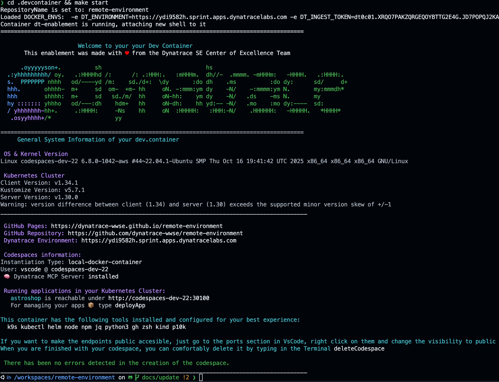
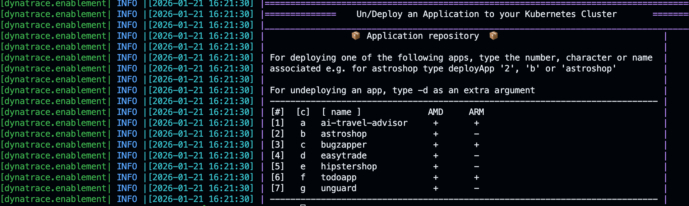

# Day to Day Operations

## 1. 📦 Containerized environment

Remember that the environment is a containerized environment, you can verify this with the username, the username in the Host is `ubuntu` and the username in the container is `vscode`.

### Host user
The user on the host is `ubuntu`
```bash
❯ whoami
ubuntu
```

### 1.1. Check that the environment is running
```bash
❯ docker ps
CONTAINER ID   IMAGE                          COMMAND                  CREATED      STATUS      PORTS                                                                                                  NAMES
4fadf6961dae   kindest/node:v1.30.0           "/usr/local/bin/entr…"   2 days ago   Up 2 days   0.0.0.0:6443->6443/tcp, 0.0.0.0:30100->30100/tcp, 0.0.0.0:30200->30200/tcp, 0.0.0.0:30300->30300/tcp   kind-control-plane
7ec72707a58c   shinojosa/dt-enablement:v1.2   "/entrypoint.sh /usr…"   2 days ago   Up 2 days 
```

You'll notice that the user is ubuntu (default user) and that containers are running, the dt-enablement image and [kind](https://kind.sigs.k8s.io/). The strategy used is docker-in-socket strategy, you can learn more about that [here](https://dynatrace-wwse.github.io/codespaces-framework/container-image/#docker-in-socket-strategy).

This allows us to have our dev environment in docker and the kubernetes also containerized but separate, for advanced use-cases you can delete the containers independently and attach them back as needed, meaning you can nuke the kubernetes cluster and create a new one without affecting the other container. 


!!! test "DevOps Mantra"
    Having a containerized environment allows you to play-around and test in a safe way, meaning feel free to install stuff, break it, and build it again which is somewhat the devops mantra ***"Build fast, fail fast, break fast & learn fast"***


### 1.2. 💻 Shell into the environment

```bash
cd .devcontainer && make start
```

??? tip "Shell into the environment"
    

When you shell into the environment, the `make start` command will check if a container with the name `dt-enablement` is running, if so, it'll connect to it, if not, then it'll create a new environment. Once inside the container the Dynatrace greeting will appear with information about the environment.

### 1.3. 💻 Create new Terminal 

For creating a new terminal in the container, just create a new Terminal in VS Code and then shell into the environment as explained before `cd .devcontainer && make start`

### 1.4. Container user
To make sure you are inside the container you can also type:
```bash
❯ whoami
vscode
```
The user is not ubuntu anymore, but vscode which is the default user for the container.

### 1.5. Show the greeting, reload the functions
The default terminal is `zsh` with powerlevel10k enabled for a better dev experience. If you want to show the greeting jsut type `printGreeting` or `zsh`. Difference is with a new shell (`zsh`) the functions are loaded again (good to know if you are developing the framework, you can add your custom functions in `my_functions.sh`). 
```bash
zsh
```

### 1.6. 💥 Nuke the environment
Let's say you want to start fresh, delete the `dt-enablement`container and nuke `kind` this is very simple, just kill and delete the containers and start again.
This will kill and delete the containers
```bash
docker kill kind-control-plane && docker rm  kind-control-plane 
docker kill dt-enablemenent && docker rm dt-enablemenent
```

### 1.7. 🔄 Restart the environment
For restarting the environment just be sure there are no containers running nor stoped, otherwise it'll start them and then type `make start` inside the `.devcontainer` folder
```bash
cd .devcontainer
make start
```


## 2. 🎡 Kubernentes
The enablement environment contains a Kubernetes  

### 2.1. Functions to manage the Kubernetes Cluster

 - `startKindCluster`: will start the cluster (or creates a new one if no stopped container is available) 
 
 - `stopKindCluster`: stops the cluster 
 
 - `createKindCluster`: creates a new cluster 
 
 - `deleteKindCluster`: deletes the cluster

 - `attachKindCluster`: attaches to a running cluster (generates the kubeconfig with the new certificates). This function can be also used from the Host like `source .devcontainer/util/source_framework.sh && attachKindCluster`. You need `kubectl` and `kind` installed on the Host.


### 2.2. Navigate in Kubernetes with k9s 

***Kubernetes CLI To Manage Your Clusters In Style!*** [K9s](https://k9scli.io/) is a terminal based UI to interact with your Kubernetes clusters, it is installed in the environment. 


It is very easy to navigate in a Kubernetes clusters with the keyboard, shell into a running container, forward a port, scale a deployment, describe a pod and more.  

Just type in the terminal `k9s` to open k9s. 
```bash
k9s
```

### 2.2.1. k9s Keybindings

| Key | Action |
|-----|--------|
| `?` | Show help/keybindings |
| `:` | Command mode |
| `/` | Filter mode |
| `Ctrl+a` | Show all resources |
| `0` | Show pods |
| `:svc` | Show services |
| `:deploy` | Show deployments |
| `:ns` | Show namespaces |
| `:node` | Show nodes |
| `Enter` | View resource details |
| `d` | Describe resource |
| `y` | View YAML |
| `e` | Edit resource |
| `l` | View logs |
| `Shift+f` | Port forward |
| `Ctrl+k` | Kill/delete resource |
| `Ctrl+d` | Delete resource |
| `s` | Shell into pod |
| `Space` | Mark/select item |
| `Esc` | Back/exit |
| `Ctrl+c` | Quit k9s |

## 3. Apps 

The enablement brings a repository of applications that can be deployed easily in the Kubernetes cluster. Running `deployApp` without parameters displays an interactive help menu listing all available apps, their aliases, and their compatibility (AMD/ARM). Example output

### 3.1. Deploy an app
Use any of the listed numbers, characters, or names. For example, to deploy astroshop, you can run:

```bash
deployApps 2
# or
deployApps b
# or
deployApps astroshop
```
### 3.2. Undeploy an app

Add `-d` (for delete) as an extra argument:

```bash
deployApps 2 -d
# or
deployApps astroshop -d 
```




<div class="grid cards" markdown>
- [Cleanup:octicons-arrow-right-24:](cleanup.md)
</div>
