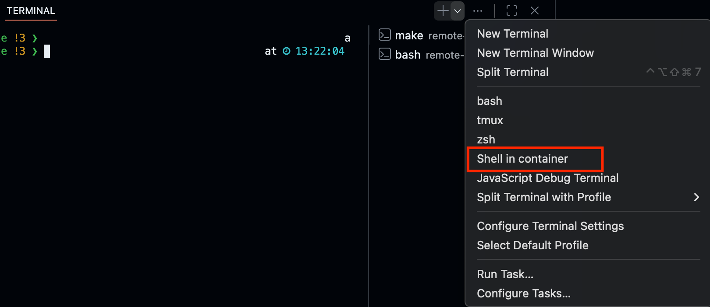
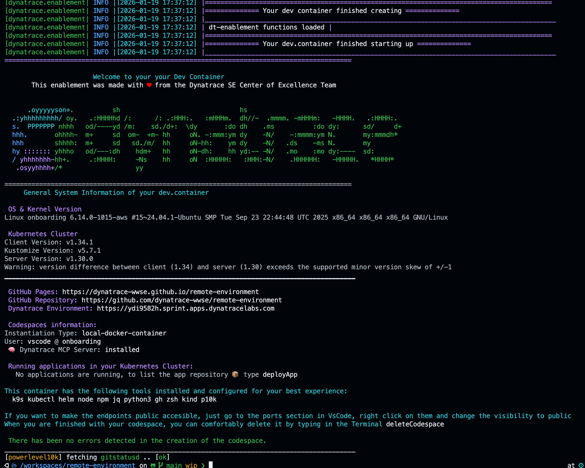
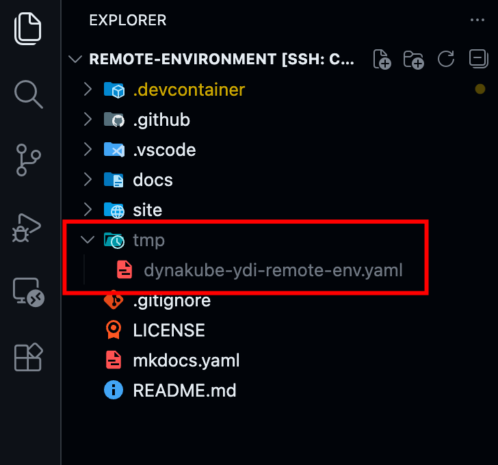
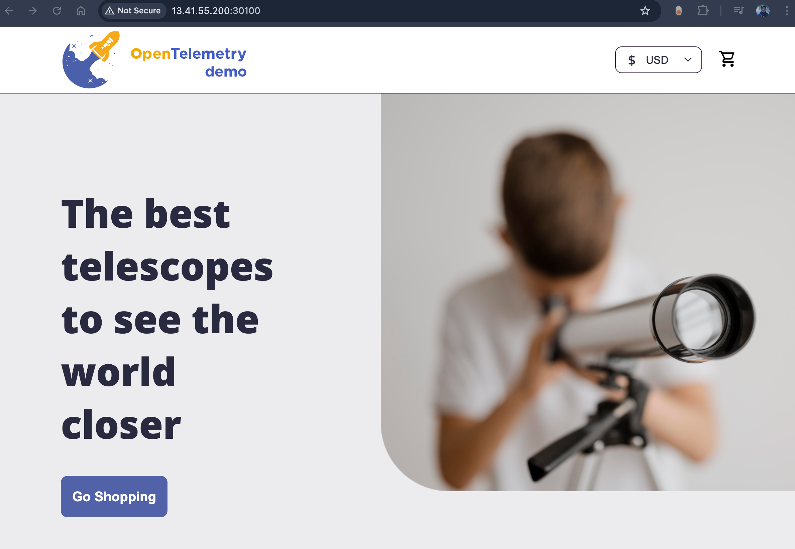

--8<-- "snippets/launch.js"

# Launch and Monitor

## 1. Launch the enablement environment

### 1.1 Start the dev container

We are ready to start the environment, open a new Terminal and go to the .devcontainer folder and start the container.

```bash
cd .devcontainer
make start
```
`make start` will either start the environment or attach a new shell to the container in case it is running. The following environment is only configured to create and start a Kind Cluster.


??? tip "Protip: Launch a Terminal inside the container wich one-click"
    So you don't have to type every time `cd .devcontainer && make start` every time to lauch the container or shell into it, there is a preconfigured terminal for you. On the terminal tab, click on the `v` icon, and select the profile "Shell in container", this will either shell in the active running container, start it if it has been stopped or create a new one if it does not exist.
    


??? "Inside the Dynatrace enablement container"
    You should be able to see a Dynatrace logo and some basic information of the container when you start the container or shell into it.

    

## 2. Monitor the Kubernetes cluster

We will monitor the Kubernetes cluster running in the environment, for this type the following commands to get a quick overview of whats running inside Kubernetes

```bash
# List the nodes
kubectl get nodes -o wide

# List the resources
kubectl get all -A

```

You'll notice this is a single node cluster (kind) and it has the minimum kubernetes services such as etcd, api-server, scheduler and proxy running on it. 


### 2.1 Install the Dynatrace Operator

We install the Dynatrace Operator using HELM same as in the public documentation or installation wizard we just opened.

```bash
helm install dynatrace-operator oci://public.ecr.aws/dynatrace/dynatrace-operator \
--create-namespace \
--namespace dynatrace \
--atomic
```

### 2.2 Deploy Dynakube with Cloud Native FullStack


#### Transfer the Dynakube file to the server
{ align=right ; width="300";}

Copy and paste the dynakube file to the server. Using VS Code is a piece of cake. I recommend to create a `tmp` folder inside the repository since this is omitted in `.gitignore` therefore no files inside of it will be staged. Right mouse click and create new folder, then copy the downloaded `dynakube.yaml` file and paste it inside the folder. VS Code will do the SSH transfer for you.


#### Deploy the Dynakube using kubectl

```bash
kubectl apply -f tmp/dynakube.yaml
```

??? warning "`command not found` -> Are you on inside the container?"
    Remember, if you get an error such as `command not found` for `kubectl`, `helm` or `k9s`, most likely you are not inside the container. You'll need to do a `make start`inside the .devcontainer folder. More information about it in the section [Day to Day Operations](/day2day)

Verify all dynatrace components are up and running
```bash
❯ kubectl get pod -n dynatrace
NAME                                         READY   STATUS    RESTARTS        AGE
dynatrace-oneagent-csi-driver-rkjvw          4/4     Running   0               5m20s
dynatrace-operator-5d88696947-f8rkd          1/1     Running   0               5m20s
dynatrace-webhook-85799477c4-5gwhn           1/1     Running   0               5m20s
dynatrace-webhook-85799477c4-gcjdg           1/1     Running   0               5m20s
remote-environment-activegate-0              1/1     Running   0               3m35s
remote-environment-extensions-controller-0   1/1     Running   0               3m25s
remote-environment-oneagent-hdr47            1/1     Running   0               3m25s
remote-environment-otel-collector-0          1/1     Running   3 (2m35s ago)   3m26s
```

## 3. Deploy the Astroshop

In the terminal inside your dev.container, type:

```bash
deployApp astroshop
```
This will deploy the Astroshop for you.

Once it's deployed, navigate to the public ip of your server and enter the http://PUBLIC-IP:30100. The framework exposes the apps using the ports 30100, 30200, 30300 using a NodePort configuration. 



!!! tip "What we have done"
    That's it! You have successfully set up a remote enablement environment with the Astroshop being monitored with Dynatrace CloudNative FullStack. You've configured VS Code to shell securely into the server so this setup can boost your learning experience. 
    
    
??? tip "Protip: accessing the `onboarding` server with a public ip OR local dns"

    ***Public IP:*** If you don't know the public IP by heart, you can also type inside the terminal the following command to generate an http link pointing to the port 30100 of the public ip:
    ```bash
    echo "http://$(curl ifconfig.me):30100"
    ```
    ***DNS***: you can also add the public IP and hostname to the hostfile on your machine, similar as we did for the SSH Configuration. This way you'll be able to access the Astroshop with the URL [http://onboarding:30100](http://onboarding:30100) from your machine.


Dive into the next section to learn about day-to-day operations with your enablement environment.

<div class="grid cards" markdown>
- [Day-to-Day Operations:octicons-arrow-right-24:](day2day.md)
</div>
